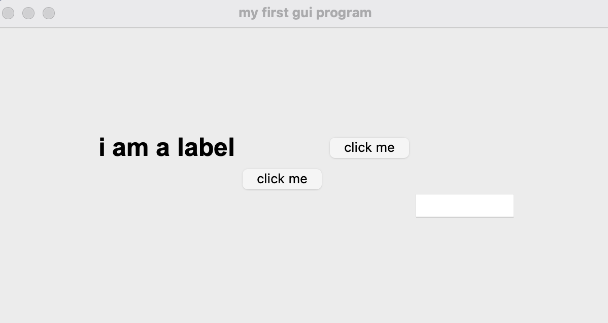
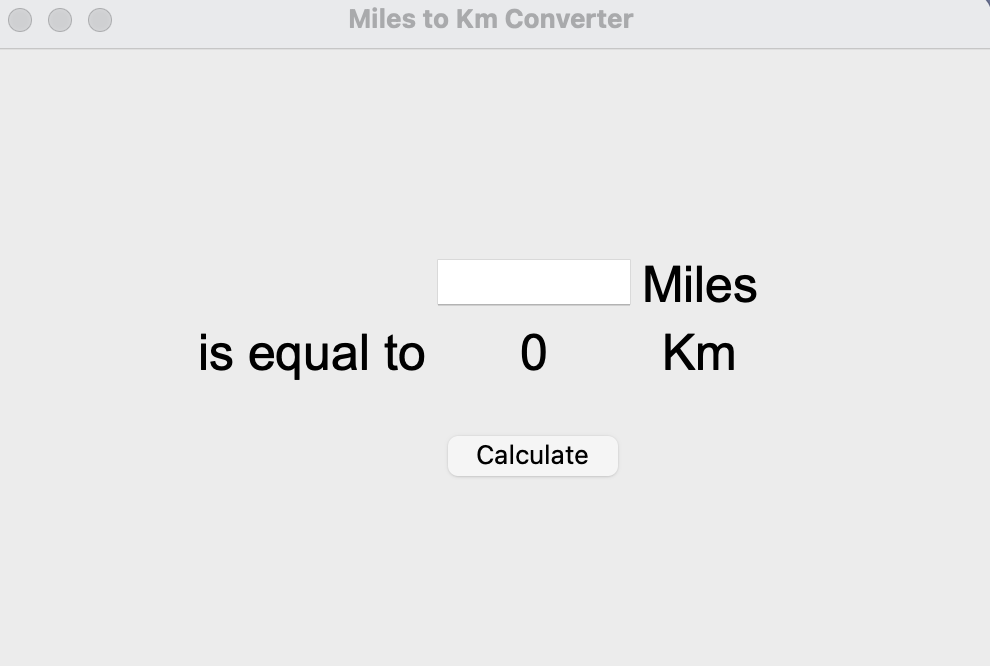

# Graphical User Interface with Tkinter and Functional Arguments

This repository demonstrates how to combine **Python functions with variable arguments** (`*args` and `**kwargs`) with **Graphical User Interface (GUI) development using Tkinter**.  

You will learn how to:

- Use unlimited positional arguments with `*args`  
- Use multiple keyword arguments with `**kwargs`  
- Build interactive GUI applications in Tkinter  

---

## Table of Contents

1. [Using `*args` for Unlimited Positional Arguments](#1-using-args-for-unlimited-positional-arguments)  
2. [Using `**kwargs` for Arbitrary Keyword Arguments](#2-using-kwargs-for-arbitrary-keyword-arguments)  
3. [Basic Tkinter GUI Example](#3-basic-tkinter-gui-example)  
4. [Miles to Kilometers Converter](#4-miles-to-kilometers-converter)  
5. [Screenshots](#5-screenshots)  
6. [How to Run](#6-how-to-run)  

---

## 1. Using `*args` for Unlimited Positional Arguments

The `*args` syntax allows passing an arbitrary number of positional arguments to a function.

```
def add(*args):
    sum = 0
    for n in args:
        sum += n
    return sum

print(add(2, 3, 4, 5, 6))
```
```
  Output: 20
```
**Explanation:**
***args** collects all positional arguments into a tuple.
The function can handle any number of arguments dynamically.

---

## 2. Using **kwargs for Arbitrary Keyword Arguments
The **kwargs syntax allows passing multiple keyword arguments.

```
def calculate(n, **kwargs):
    print(kwargs)
    n += kwargs["add"]
    n *= kwargs["multiply"]
    print(n)

calculate(2, add=3, multiply=5) 
```
``` 
Output: {'add': 3, 'multiply': 5} 25
```
**Explanation:**
**kwargs collects keyword arguments into a dictionary.
Values can be accessed by key, allowing flexible calculations.

---
## 3. Basic Tkinter GUI Example
A simple GUI demonstrating labels, buttons, and entry fields.
```
from tkinter import *

window = Tk()
window.title("My First GUI Program")
window.minsize(width=500, height=300)
window.config(padx=100, pady=100)

# Label
my_label = Label(text="I am a label", font=("Arial", 25, "bold"))
my_label.grid(column=0, row=0)

# Function for button click
def button_clicked():
    new_text = input.get()
    my_label.config(text=new_text)

# Buttons
button = Button(text="Click Me", command=button_clicked)
button.grid(column=1, row=1)

button2 = Button(text="Click Me", command=button_clicked)
button2.grid(column=2, row=0)

# Entry field
input = Entry(width=10)
input.grid(column=3, row=2)

window.mainloop()
```
---



---

## 4. Miles to Kilometers Converter
A simple Tkinter GUI to convert miles to kilometers.
```
from tkinter import *

window = Tk()
window.title("Miles to Km Converter")
window.minsize(width=500, height=300)
window.config(padx=100, pady=100)

# Input field
miles_input = Entry(width=10)
miles_input.grid(row=0, column=1)

# Labels
miles_label = Label(text="Miles", font=("Arial", 25))
miles_label.grid(row=0, column=2)

equal_label = Label(text="is equal to", font=("Arial", 25))
equal_label.grid(row=1, column=0)

kilometer_result_label = Label(text="0", font=("Arial", 25))
kilometer_result_label.grid(row=1, column=1)

km_label = Label(text="Km", font=("Arial", 25))
km_label.grid(row=1, column=2)

# Conversion function
def miles_to_km():
    miles = float(miles_input.get())
    km = miles * 1.609
    kilometer_result_label.config(text=f"{km:.2f}")

# Button
calculate_button = Button(text="Calculate", command=miles_to_km)
calculate_button.grid(row=2, column=1, pady=20)

window.mainloop()
```
---
### Miles to Km Converter



### Author
**Sworup Khadka** Graphical User Interface with Tkinter and Functional Arguments