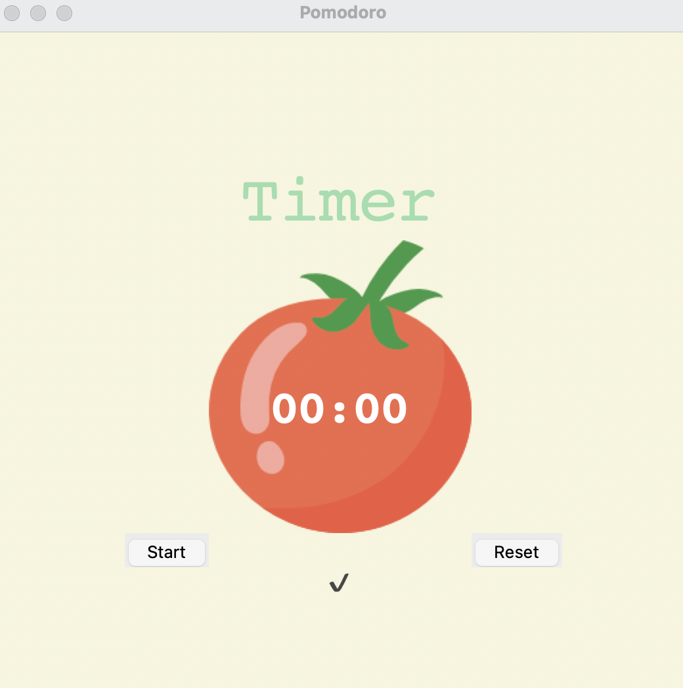

# Pomodoro Timer (Tkinter)

A simple **Pomodoro Timer App** built using Python’s **Tkinter** GUI library.  
This app helps improve focus and productivity using the **Pomodoro Technique** — alternating between focused work sessions and short/long breaks.

---

##  Features

- Start and Reset buttons  
- Work / Short Break / Long Break cycles  
- Timer automatically moves between sessions  
- Time displayed in **MM:SS** format  
- Checkmarks (`✓`) appear for each completed work session  
- Simple and colorful user interface  

---

## How It Works

The app follows the Pomodoro principle:

- **Work session** → Focus on a task  
- **Short break** → Quick rest  
- **Long break** → After several sessions, take a longer rest  

After every 8th session, a long break begins automatically.

---

## 🖥️Full Source Code

```
from tkinter import *
import math

# ---------------------------- CONSTANTS ------------------------------- #
PINK = "#e2979c"
RED = "#e7305b"
GREEN = "#9bdeac"
YELLOW = "#f7f5dd"
FONT_NAME = "Courier"
WORK_MIN = 1
SHORT_BREAK_MIN = 5
LONG_BREAK_MIN = 20
reps = 0
timer = None

# ---------------------------- TIMER RESET ------------------------------- # 
def reset_timer():
    global reps
    window.after_cancel(timer)
    reps = 0
    canvas.itemconfig(timer_text, text="00:00")
    title_label.config(text="Timer", fg=GREEN)
    check_mark.config(text="")

# ---------------------------- TIMER MECHANISM ------------------------------- # 
def start_timer():
    global reps
    reps += 1
    
    work_sec = WORK_MIN * 60
    short_break_sec = SHORT_BREAK_MIN * 60
    long_break_sec = LONG_BREAK_MIN * 60
    
    if reps % 8 == 0:
        title_label.config(text="Long Break", fg=RED)
        count_down(long_break_sec)
    elif reps % 2 == 0:
        title_label.config(text="Short Break", fg=PINK)
        count_down(short_break_sec)
    else:
        title_label.config(text="Work", fg=GREEN)
        count_down(work_sec)

# ---------------------------- COUNTDOWN MECHANISM ------------------------------- # 
def count_down(count):
    global timer
    count_min = math.floor(count / 60)
    count_sec = count % 60
    canvas.itemconfig(timer_text, text=f"{count_min:02d}:{count_sec:02d}")

    if count > 0:
        timer = window.after(1000, count_down, count - 1)
    else:
        start_timer()
        marks = ""
        work_sessions = math.floor(reps / 2)
        for _ in range(work_sessions):
            marks += "✓"
        check_mark.config(text=marks)

# ---------------------------- UI SETUP ------------------------------- #
window = Tk()
window.title("Pomodoro")
window.config(padx=100, pady=100, bg=YELLOW)

title_label = Label(text="Timer", fg=GREEN, font=(FONT_NAME, 50), bg=YELLOW)
title_label.grid(row=0, column=1)

canvas = Canvas(width=200, height=224, bg=YELLOW, highlightthickness=0)
tomato_img = PhotoImage(file="tomato.png")
canvas.create_image(100, 112, image=tomato_img)
timer_text = canvas.create_text(100, 130, text="00:00", fill="white", font=(FONT_NAME, 35, "bold"))
canvas.grid(row=1, column=1)

start_button = Button(text="Start", highlightthickness=0, command=start_timer)
start_button.grid(row=2, column=0)

reset_button = Button(text="Reset", highlightthickness=0, command=reset_timer)
reset_button.grid(row=2, column=2)

check_mark = Label(bg=YELLOW, fg=GREEN)
check_mark.grid(row=3, column=1)

window.mainloop()
```

##  Screenshot


---
## Dynamic Typing in Python

Python is a **dynamically typed language**, which means that you **don’t need to declare variable types explicitly**.  
The interpreter automatically assigns a type to a variable at runtime based on the value it holds.

---

## Key Points

- **Variable types are determined at runtime**
- **The type of a variable can change** during program execution
- Provides **flexibility** but requires careful type management

---

## 🔹 Examples

```
# Assign an integer
x = 10
print(type(x))  # <class 'int'>

# Reassign a string
x = "Hello"
print(type(x))  # <class 'str'>

# Reassign a list
x = [1, 2, 3]
print(type(x))  # <class 'list'>
```
