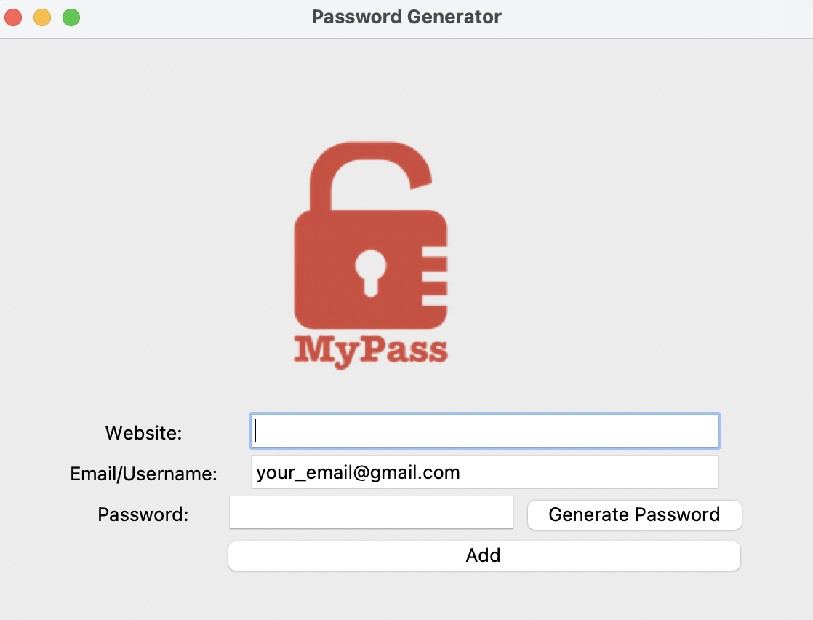
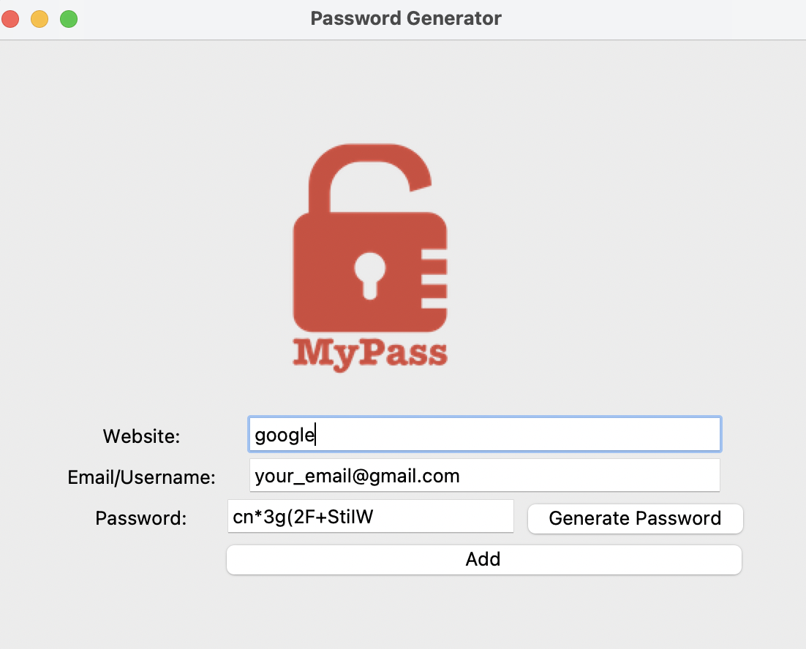
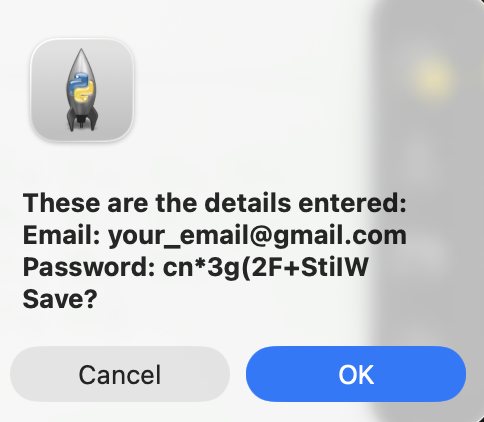
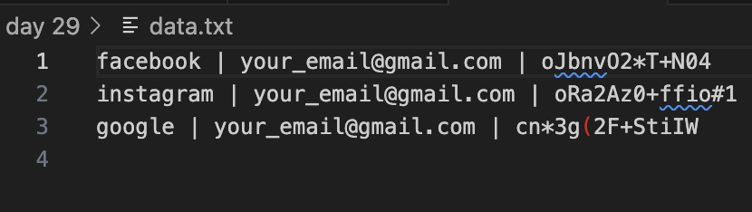

## Password Manager (Tkinter)

A simple Password Manager GUI application built using Python’s Tkinter library. 

#### It allows users to:

- Generate strong random passwords
- Save website, email, and password into a local file
- Confirm entries before saving
- Use a clean, user-friendly GUI

---

## Features
#### 1.Random Password Generator

- Generates strong passwords with letters, numbers, and symbols
- Automatically inserts the password into the password input field
- Uses random.choice() and random.shuffle()
####  2.Save Login Details

- Saves data in data.txt in this format:
 website | email | password
- Prevents empty fields
- Asks for confirmation using ```messagebox.askokcancel```

#### 3.Clean Tkinter GUI

- Organized layout using .grid()
- Logo displayed using Canvas (img/logo.png)
- Pre-filled email entry
- Buttons for password generation and saving

---

## How It Works
#### 1.Generate Password

Click “Generate Password”
Random password appears in the password input field

#### 2.Fill Website & Email

Enter your website name
Email is pre-inserted but editable

#### 3.Save

Click “Add”
A confirmation box appears
On approval, data is written to data.txt

---
##  Run the Program

Make sure your terminal is in the day 29 folder and run:
python3 main.py

---

## Screenshots

---
### Empty Fields


---
### Filled Fields


---
### Confirmation Box


---
### Saved Data File


---
## Concepts Used

- Tkinter GUI: Labels, Entries, Buttons, Canvas

- Messagebox dialogs

- File I/O (open, append)

- Random number & character generation

- List manipulation & shuffling


