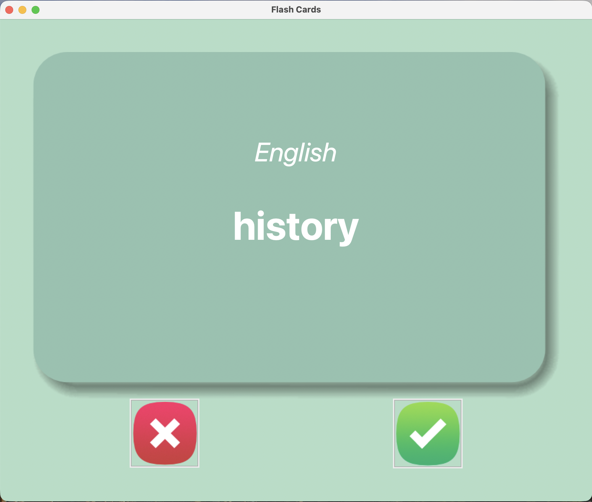

# Flash Cards – French Learning App

A simple Tkinter-based flash card application that helps you learn French words by flipping cards and tracking progress.
---

## Features
- Shows a French word on the front of the card
- Automatically flips the card after 3 seconds to reveal the English meaning
- Saves learned words into words_to_learn.csv
- Automatically loads progress on restart
- Clean and user-friendly UI made using Tkinter
- Randomly picks a new word every time

---
## Buttons to mark:

✔ Known
❌ Unknown

---

## Project Structure
```
flash-cards/
│
├── main.py
├── README.md
│
├── data/
│   ├── french_words.csv
│   └── words_to_learn.csv  (auto-generated after using the app)
│
└── images/
    ├── card_front.png
    ├── card_back.png
    ├── right.png
    └── wrong.png
```
---
## Requirements
- Python Libraries
- pandas
- tkinter  (built-in)

---


## How It Works
#### 1. Load Data
- App first checks if words_to_learn.csv exists
- If not, it loads french_words.csv
- All words are stored as a list of dictionaries

### 2. Display Cards
- Shows French word first
- After 5 seconds, card flips to show English translation

### 3. User Inputs
- ✔ Known Button
- Removes the word from the list
- Saves progress in words_to_learn.csv

---

### ❌ Unknown Button
- Keeps the word for future practice
- Loads next card

---
## Screenshots 


#### French word:


---

#### English word


---
## Future Improvements
- Add confusion_words.csv (track hard words)
- Add progress bar / stats
- Add restart progress button
- Add dark mode